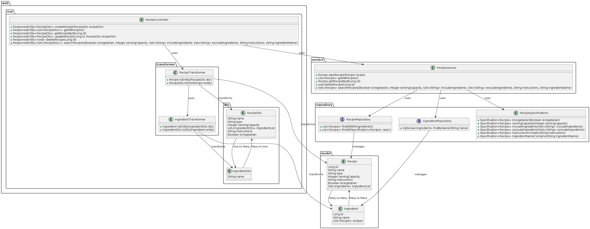

# Recipe Management Application

This is a Recipe Management application built with Spring Boot, JPA, and MySQL. The application allows users to create, retrieve, update, delete, and search for recipes.

## Prerequisites

Before running the application, ensure you have the following installed:

1. **Java 17**: Ensure that you have Java Development Kit (JDK) 17 installed on your machine.
2. **Gradle**: This project uses Gradle as the build tool.
3. **MySQL**: The application uses MySQL as the database.

## MySQL Configuration

1. **Install MySQL**: If you haven't installed MySQL, you can download and install it from [here](https://dev.mysql.com/downloads/installer/).
2. **Create Database**: Create a database for the application.
   ```sql
   CREATE DATABASE recipe_management;
   ```
3. **Update Configuration**: Update the `application.properties` file with your MySQL database configurations.
   ```properties
   spring.datasource.url=jdbc:mysql://localhost:3306/recipe_management
   spring.datasource.username=root
   spring.datasource.password=yourpassword
   spring.jpa.hibernate.ddl-auto=update
   ```

## How to Compile

To compile the project, use Gradle:

```bash
navigate to 'Favourite-recipe-manager'
./gradlew clean build
```

## How to Run

To run the application, execute the following Gradle command:

```bash
navigate to 'Favourite-recipe-manager'
./gradlew bootRun
```

Alternatively, you can build the project into a JAR file and run it:

```bash
navigate to 'Favourite-recipe-manager'
./gradlew clean build
java -jar build/libs/recipe-management-0.0.1-SNAPSHOT.jar
```

Ensure MySQL is running and the database configuration in `application.properties` is correct before running the application.

## How to Test

To run the tests, use the following Gradle command:

```bash
navigate to 'Favourite-recipe-manager'
./gradlew test
```

This will run all the unit and integration tests defined in the project.

## UML class diagram



## API Endpoints

### Recipe Endpoints

1. **Create a new recipe**
   ```http
   POST /recipe
   ```
   **Request Body**:
   ```json
   {
     "name": "Test Recipe",
     "type": "Dessert",
     "servingCapacity": 4,
     "instructions": "Mix and bake.",
     "isVegetarian": true,
     "ingredientList": [
       {
         "name": "Salt"
       },
       {
         "name": "Sugar"
       }
     ]
   }
   ```
   **Response**:
   ```json
   {
     "id": 1,
     "name": "Test Recipe",
     "type": "Dessert",
     "servingCapacity": 4,
     "instructions": "Mix and bake.",
     "isVegetarian": true,
     "ingredientList": [
       {
         "name": "Salt"
       },
       {
         "name": "Sugar"
       }
     ]
   }
   ```

2. **Get all recipes**
   ```http
   GET /recipe
   ```
   **Response**:
   ```json
   [
     {
       "id": 1,
       "name": "Test Recipe",
       "type": "Dessert",
       "servingCapacity": 4,
       "instructions": "Mix and bake.",
       "isVegetarian": true,
       "ingredientList": [
         {
           "name": "Salt"
         },
         {
           "name": "Sugar"
         }
       ]
     }
   ]
   ```

3. **Get a recipe by ID**
   ```http
   GET /recipe/{id}
   ```
   **Response**:
   ```json
   {
     "id": 1,
     "name": "Test Recipe",
     "type": "Dessert",
     "servingCapacity": 4,
     "instructions": "Mix and bake.",
     "isVegetarian": true,
     "ingredientList": [
       {
         "name": "Salt"
       },
       {
         "name": "Sugar"
       }
     ]
   }
   ```

4. **Update a recipe**
   ```http
   PUT /recipe/{id}
   ```
   **Request Body**:
   ```json
   {
     "name": "Updated Recipe",
     "type": "Main Course",
     "servingCapacity": 5,
     "instructions": "Mix and grill.",
     "isVegetarian": false,
     "ingredientList": [
       {
         "name": "Salt"
       },
       {
         "name": "Pepper"
       }
     ]
   }
   ```
   **Response**:
   ```json
   {
     "id": 1,
     "name": "Updated Recipe",
     "type": "Main Course",
     "servingCapacity": 5,
     "instructions": "Mix and grill.",
     "isVegetarian": false,
     "ingredientList": [
       {
         "name": "Salt"
       },
       {
         "name": "Pepper"
       }
     ]
   }
   ```

5. **Delete a recipe**
   ```http
   DELETE /recipe/{id}
   ```
   **Response**:
   ```http
   204 No Content
   ```

6. **Search for recipes**
   ```http
   GET /recipe/search
   ```
   **Query Parameters**:
    - `isVegetarian` (optional): Filter by vegetarian status.
    - `servingCapacity` (optional): Filter by serving capacity.
    - `includeIngredients` (optional): Filter by included ingredients (comma-separated).
    - `excludeIngredients` (optional): Filter by excluded ingredients (comma-separated).
    - `instructions` (optional): Filter by instructions containing specific text.
    - `ingredientName` (optional): Filter by ingredient name.

   **Example Request**:
   ```http
   GET /recipe/search?isVegetarian=true&ingredientName=Salt
   ```
   **Response**:
   ```json
   [
     {
       "id": 1,
       "name": "Test Recipe",
       "type": "Dessert",
       "servingCapacity": 4,
       "instructions": "Mix and bake.",
       "isVegetarian": true,
       "ingredientList": [
         {
           "name": "Salt"
         },
         {
           "name": "Sugar"
         }
       ]
     }
   ]
   ```

## Architectural Choices

### Spring Boot

The application is built using Spring Boot, which simplifies the setup and development of new Spring applications. It provides a robust, production-ready environment that integrates with the Spring ecosystem.

### JPA and Hibernate

Java Persistence API (JPA) and Hibernate are used for Object-Relational Mapping (ORM). This allows the application to interact with the database using Java objects, making database operations more intuitive and reducing boilerplate code.

### MySQL

MySQL is used as the relational database management system. It is widely used and supported, providing reliable and efficient storage for the application's data.

### RESTful API

The application exposes a RESTful API for managing recipes. This allows for easy integration with front-end applications or other services.

### DTOs and Transformers

Data Transfer Objects (DTOs) are used to encapsulate the data sent to and from the client. Transformers are used to convert between entities and DTOs, promoting a clean separation between the data layer and the API layer.

### Unit and Integration Testing

JUnit 5 and Mockito are used for unit testing, ensuring that individual components of the application work as expected. Integration tests are used to verify that different parts of the application work together correctly, including interactions with the database.

## Acknowledgments

- Spring Boot
- MySQL
- Lombok
- Hibernate
- Mockito
- JUnit 5